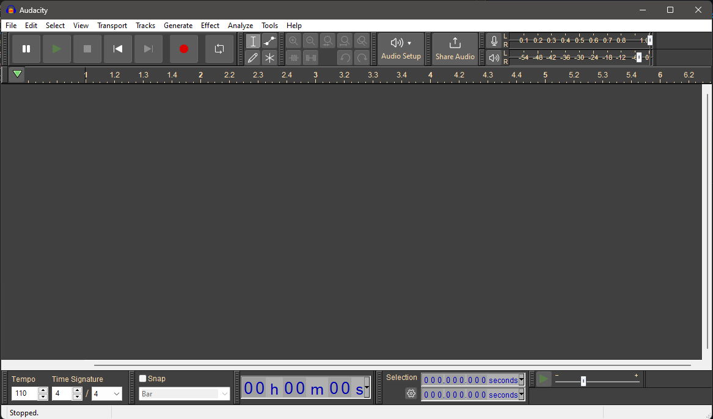
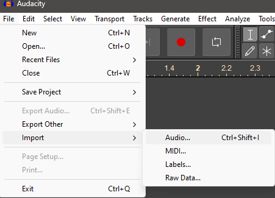
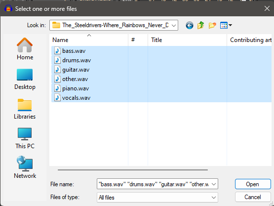
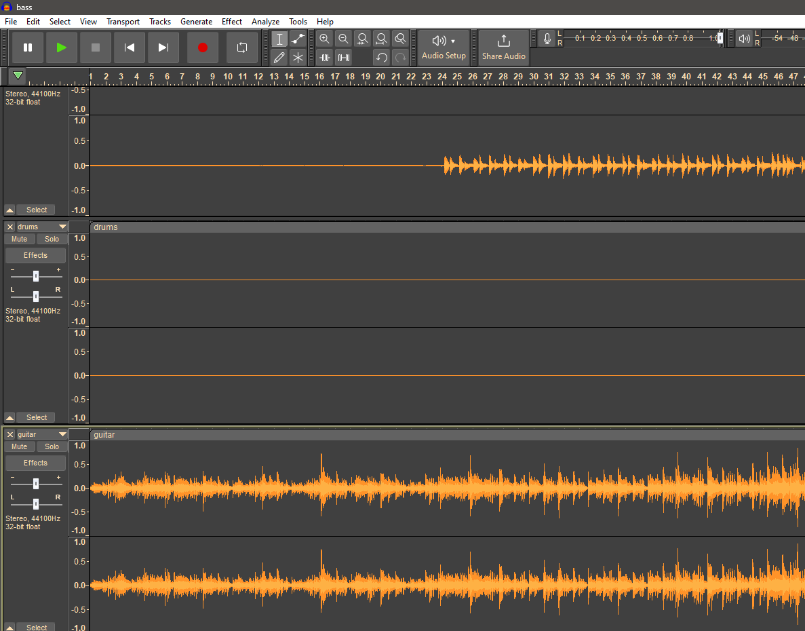
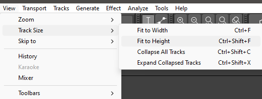
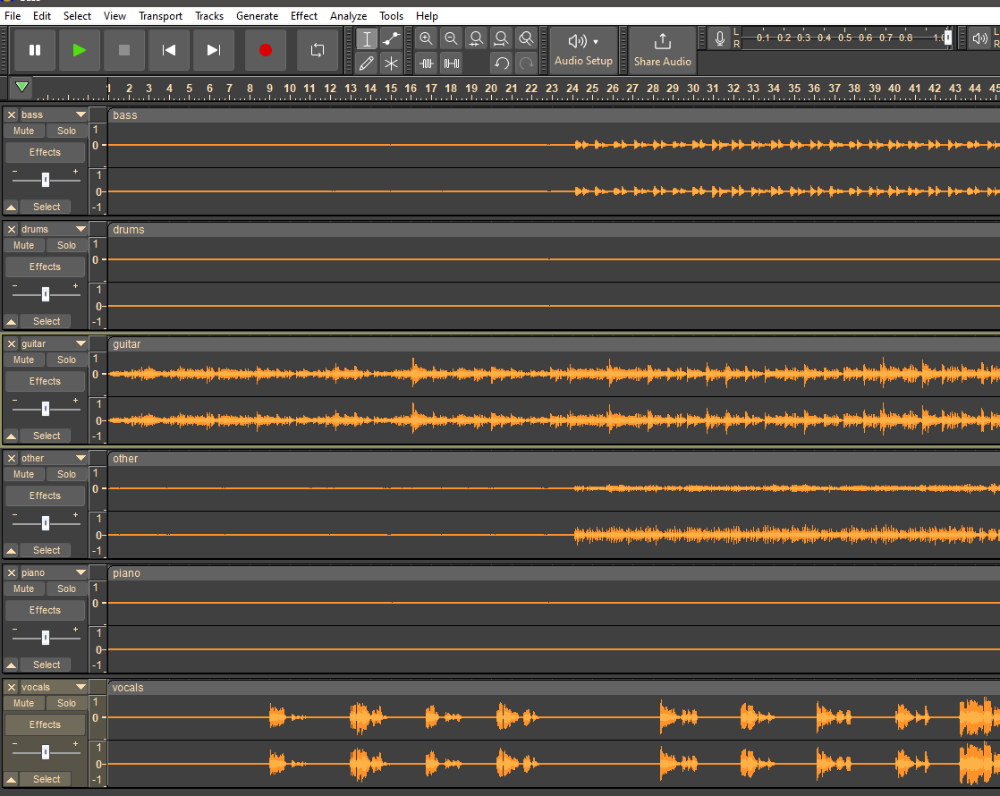

# Audacity as pseudo-DAW

First you need to have Audacity (which by itself is a decent program, and completely free/open source)

## Download Audacity
[Audacity](https://www.audacityteam.org/)

## Open Audacity

Then, you need to stick something in the main window

## Grab some "stems"
"Stems" are essentially tracks.  

I feed a track to the AI.  The AI spits out the track (as best it can - it's not perfect, but it's "good enough").  Depending on what options I select, it'll either be:
* 4 separate tracks: (drums, bass, vocals and "everything else") or 
* 6 separate tracks: (drums, bass, vocals, piano, guitar, "everything else")

> [!NOTE] Ask Mike if you need/want a song "stem-ified".  Also for where the stems are.

For now, I'll just use some separated tracks that I have on my PC.  

Go to "File->Import->Audio..."  

And in the dialog that pops up, select the 4 (or 6) tracks all at once.  

You'll get something that looks like this:

Resize them all to fit on the screen with "View->Track Size->Fit to Height"

Now you'll have something sexy like this:

Now, you can just click "play" (or use spacebar - it toggles between play and stop) to play all 6 tracks together.  While it's playing, you can selectively mute / solo tracks, or (holding SHIFT) click on multiple tracks. 

Then you can solo a few at a time (e.g. vocals and guitar, or bass and guitar ... whatever).  If you don't hold SHIFT, then when you click SOLO or MUTE in the track, it'll just do that single track.

